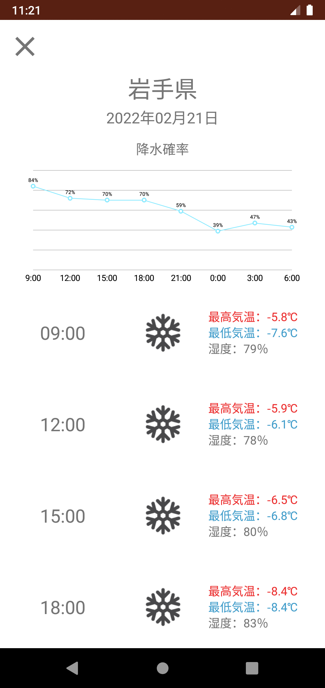
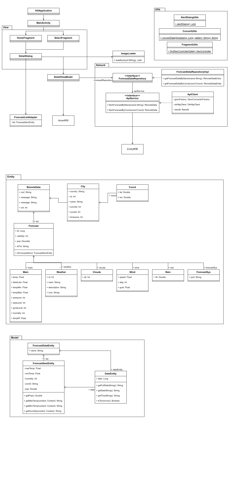
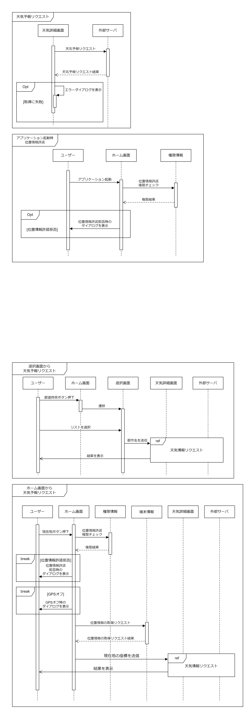

## お天気アプリを作る（12月～1月）
- 研修プログラム
- 基本設計書を基にお天気アプリを作成
- 実装→テスト→設計（逆起こし）
- プロジェクト管理ツール、GitHubでのソース管理

## 予定
- 基本的な部分を12月末から1月中旬までに実装
- 残りの部分でオリジナリティの追加
  - アニメーション
  - ウィジェットを作成するなど

## 必須機能
- スプラッシュ画面
  - 起動時に表示
- メイン画面
  - 都道府県選択画面へ遷移するボタンと現在地の情報を取得する画面に遷移するボタンを２つ設置
- 都道府県選択画面
  - ヘッダ：画面名
  - 戻るボタン：メイン画面へ戻る
  - 表示：都道府県をリスト形式で表示
  - 選択：天気詳細画面を表示
- 天気詳細画面
  - 画面：モーダルで表示
  - 閉じるボタン：画面を閉じる
  - 表示：天気・地名・日付。3時間おきに予報を24h分。最高/最低気温、湿度の表示。時刻(0:00には翌日の日付を表示)
- 位置情報取得許可ダイアログ
  - OSのバージョンによって異なるが、OSから許諾を得るためのダイアログを表示する
- 位置情報取得不可ダイアログ
  - 閉じるボタン：ダイアログを閉じる
  - 設定：OSの設定画面へ遷移する
- 天気情報はOpenWeatherMap APIを使って取得
  - 都市名から天気情報を取得
  - 位置座標から天気を取得
  - 通信中はインディケーターを表示(操作不可が望ましい)
  - エラーハンドリング
- オリジナル機能

## APIキーの設定方法
プロジェクト直下の`local.properties`にAPIキーを記載
``` properties
weather_api_key={API key}
```

## オリジナル機能
- 天気詳細画面での降水確率のチャートを表示


## UML
### クラス図


### シーケンス図
